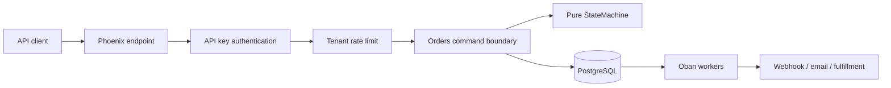
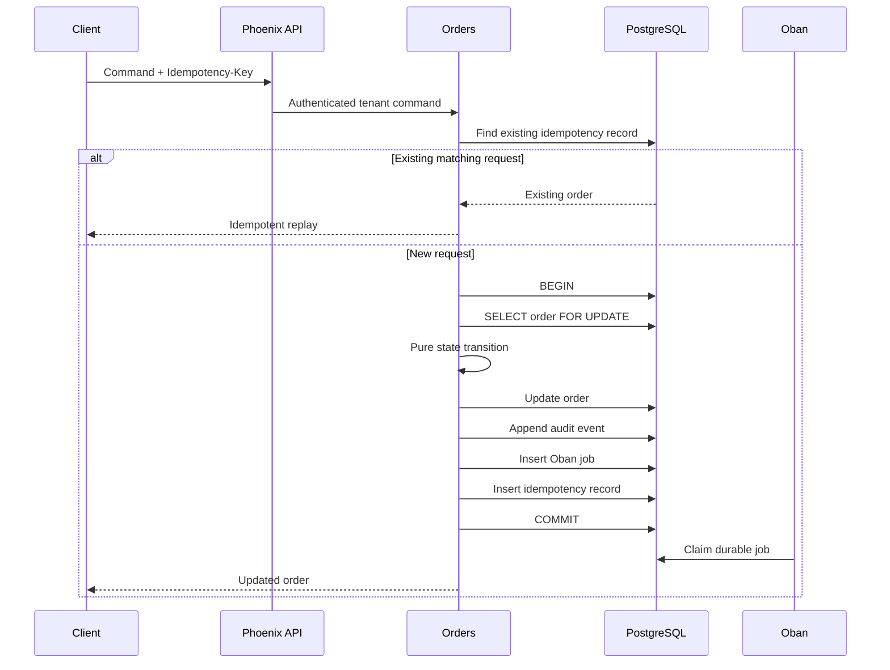

# Architecture

## Context

Relay Orders accepts order commands from clients that may timeout, retry, or
send concurrent requests. The system must preserve valid workflow state,
maintain tenant isolation, and never lose committed follow-up work.

## Components

## Write transaction

## Reliability properties

- Duplicate requests with the same body return the original resource.
- Reusing an idempotency key with different input is rejected.
- Row locks serialize commands against one order.
- Event sequence numbers match aggregate versions.
- State, event, job, and idempotency record commit atomically.
- Failed workers retry independently without rolling back business state.

## Boundaries

`Relay.Orders.StateMachine` owns workflow policy and is pure.

`Relay.Orders` coordinates persistence and transactions.

`RelayWeb` owns HTTP authentication, validation, serialization, and status
codes.

`Relay.Workers` owns asynchronous integration boundaries.

This separation keeps domain logic testable while allowing infrastructure to
evolve independently.
